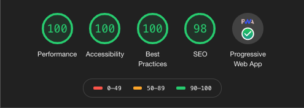

# khuynh-gatsby-theme
author(s): khuynh

## Overview
For my current personal website, https://kennyvh.com, I wanted to take the lightest approach possible, so I simply did everything in HTML/CSS and wanted to optimize size and speed.

I also have a private blog that utilizes the [the-plain-gatsby](https://www.gatsbyjs.org/starters/wangonya/the-plain-gatsby/) theme and I have been very impressed with its performance and size. Below are the two Google Chrome Lighthouse scores for my plain html/css blog (left) and my private gastby blog (right). The performance score is really the most important one since I can always optimize better for SEO and Acessibility.

The vanilla html/css blog is ~2.5x faster than the gatsby blog. This is unfortunate, but you have to consider all of the great features you get with the gatsby blog including (but not limited to): image optimization, integration with netlify CMS, getting to use React (i've been having a blast with this), and many more thanks to the rich gatsby ecosystem.

    
    

| blog         | speed index | size   |
| ------------ | ----------- | ------ |
| vanilla blog | 0.8s        | 24.8kB |
| private blog | 2.1s        | 159kB  |

One of my other fears was that using Gatsby would inhibit people from viewing my page with javascript disabled, however that is not the case at all.

With javascript disabled, most of my styling was preserved and the page was still extremely responsive and snappy (besides the really ugly warning that this theme adds when js is disabled). This is something I'd like to keep in mind when creating my own theme.

Also, after reading Tania Rascia's [fantastic blog](https://www.taniarascia.com/migrating-from-wordpress-to-gatsby/), I've decided to take a stab at making my own gatsby theme as well.

So here, I have a duplicated version of [gatsby-advanced-starter](https://github.com/vagr9k/gatsby-advanced-starter/) and hope to get a theme up for the next revision of my site, https://kennyvh.com.

Cheers!